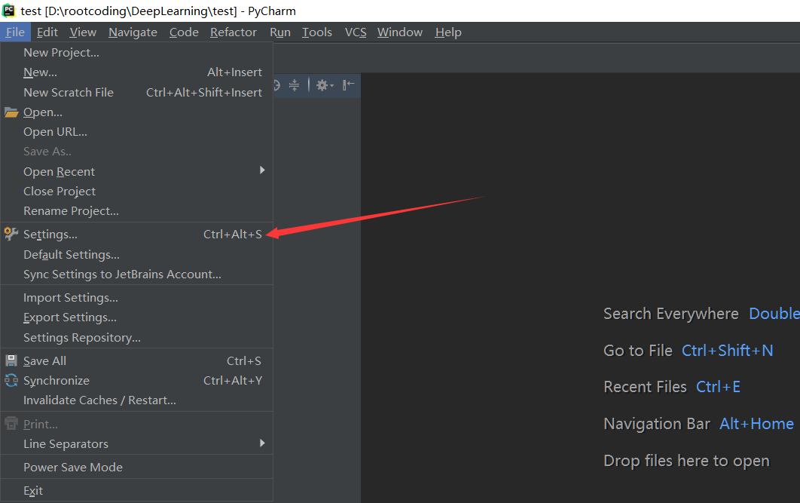
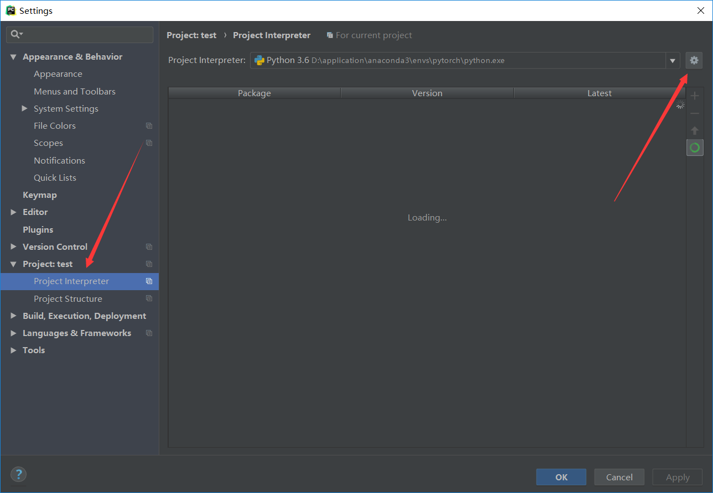
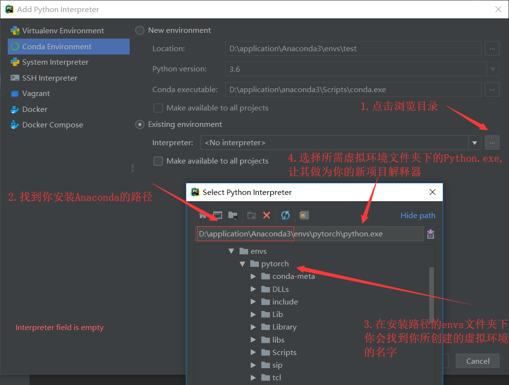

## 如何用Conda优雅的管理Python环境
---

##### 简单说明
>**很多时候,避免不了同时使用python2和python3的环境,也避免不了不同的工作所需要不同版本的库文件,比如在想用TensorFlow较早版本的同时;还想运行Pytorch最新版；还想顺便学习Nao机器人编程,学习Django后台,这个时候,一款非常好用的包管理工具就显得十分重要了,这就是我写这篇博客的原因,这篇博客将会讲解：如何安装conda; 如何更换conda的下载源; 如何使用canda;如何在Pycharm中切换不同的工作环境;    注：这里暂时只介绍Windows下的教程,如果有需要,以后再单独写Linux下的教程**

[TOC]

###  1.如何安装conda

**在Windows下,只需要安装Anaconda,就可以使用Conda的功能,这里我推荐下载清华镜像源的[Anaconda](https://mirrors.tuna.tsinghua.edu.cn/anaconda/archive/),因为官方源下载速度实在是感人...,这里提供5.2.0最新版的直接下载链接([右键点击我,选择使用迅雷下载](https://mirrors.tuna.tsinghua.edu.cn/anaconda/archive/Anaconda3-5.2.0-Windows-x86_64.exe))**

> 什么是Anaconda:
> Anaconda指的是一个开源的Python发行版本,其包含了conda、Python等180多个科学包及其依赖项。因为其包含了大量的科学包,所以可以带来许多的便利,其中的Conda也堪称包管理神器。

下载后,基本上是傻瓜式安装,需要注意的是,在安装时这两个选项需要点上：


###  2.如何更换conda的下载源

**为什么要更换源？因为Conda官方的下载源太慢了,而且经常会出现HTTPERROR之类的错误,如果想要用Conda愉快的创建不同工作环境,愉快的下载安装各种库,那么换下载源是必不可少的，下面的命令是用来添加清华的下载源,然后Conda优先会从清华源下载所需的文件：**
```
conda config --add channels https://mirrors.tuna.tsinghua.edu.cn/anaconda/pkgs/free/
conda config --add channels https://mirrors.tuna.tsinghua.edu.cn/anaconda/cloud/conda-forge 
conda config --add channels https://mirrors.tuna.tsinghua.edu.cn/anaconda/cloud/msys2/

conda config --set show_channel_urls yes
# 设置搜索时显示通道地址
```
###  3.如何使用conda

**终于到了重点部分,在这里会介绍使用Conda查看环境;创建环境;环境切换;删除环境;包管理;克隆环境;**
#### 1.查看环境
```
conda info -e
conda info --envs
# 上面两个都是查看当前系统环境,第二个用的是详细参数
```
#### 2.创建环境
```
conda create -n name python=3.6
# name参数指定虚拟环境的名字,python参数指定要安装python的版本,但注意至少需要指定python版本或者要安装的包,在后一种情况下,自动安装最新python版本
# 例如
conda create -n naoqi pillow numpy python=2.7.14
# 创建名字为naoqi,Python版本为2.7.14的虚拟环境,同时还会安装上pillow numpy这两个库
```
#### 3.环境切换
```
activate naoqi
# 切换到naoqi环境下,在切换环境后,所执行的Pip命令,Python命令,都是更改当前环境下的,不会影响到其他的环境

deactivate
# 退出当前环境,也可以在已激活环境的情况下使用`activate root`切回root环境
```
#### 4.删除环境
```
conda remove -n naoqi --all
# 删除名为naoqi的环境
```
#### 5.包管理
**在这里,我也会写出pip的包管理命令**
```
conda list 
# 显示当前环境下所有库,以及它的Build,Channel信息

conda install pillow=5.1.0
# 安装版本为5.1.0的pillow库,如不指定版本默认安装最新版

conda update pillow
# 将pillow库升级到最新版

conda search matplotlib
# 搜索matplotlib这个库有哪些版本可以用conda安装

conda remove numpy
# 删除当前环境下的numpy库

******************************分割线********************************
pip list
# 显示当前环境下的库,带版本号

pip install numpy=1.14.3
# 安装版本为1.14.3的numpy库，如不指定版本参数(=1.14.3),默认安装最新版

pip install -U numpy
# 将numpy库升级到最新版

pip search numpy
# 搜索与numpy名字相关的包

pip unisntall numpy
# 删除名为numpy的库
```
#### 6.环境克隆
```
conda create --name naoqi_1 --clone naoqi
# 制作naoqi环境的克隆,名字为naoqi_1
```
### 4.如何在Pycharm中切换不同的工作环境
**在创建了不同的环境后,只需要用activate激活环境,再在激活环境的情况下输入idle就可以使用当前环境下的简洁的集成开发环境,但有些同学可能需要使用像Pycharm之类的专业的集成开发环境,因为Pycharm在每创建一个项目都需要指定相应的Python解释器,在结合conda后,可以通过切换不同虚拟环境下的解释器来达到满足编写各种项目的需求(虽然Pycharm已经集成了Python环境创建啦...),下面是Pycharm Professional最新版的工作环境切换演示：**
##### 1.在创建新项目之后进入setting:

##### 2.在打开Project Interpretor选项后单击小齿轮出现的选项ADD

##### 3.按照指示找到你需要切换的虚拟环境下的Python.exe文件

**在找到正确的Python解释器后,Pycharm会自动索引相关的库文件**
