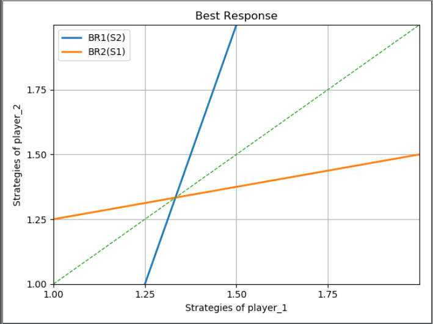

### 第四讲
---
##### Game1:Partnership Game

> 有两个实体共同完成一个协作项目,这两家公司平分Profits,每个股东都要选择为公司投入多少精力
strategy：Going to do it in hours **[0,1,2,3,4]**   ,it is continuum of possible choices
profits :$ 4*[I + II + b*I*II]  b \in [0 , \frac {1}{4}]  $ ,there're some synergies **协同**
payoffs: $ U_{1}(S_{1},S_{2}) = \frac {1}{2} * 4*[S_{1} + S_{2} + b*S_{1}*S_{2}]- (S_{1})^2  $ , U2 same as U1

#####  Strategies of game:

1. 在$S_{2}$已知的情况下求$S_{1}$的最大值(**偏导数**) ：
$2*(1 + b*S_{2} -2*S_{1})$
2. 用二阶导数求出最大值或最小值，这里的二阶导数小于零(**-2**),为最大值
3. 使其一阶导数等于零，求出$S_{1},S_{2}$的函数关系:
1.在策略$S_{2}$下参与者**I**的最佳对策$BR_{1}(S_{2}):S_{1}=1+b*S_{2}$    
2.在策略$S_{1}$下参与者**II**的最佳对策$BR_{2}(S_{1}):S_{2}=1+b*S_{1}$
4. 绘制图像(**这里b取1/4**)：

由图可知，当参与者II的策略选择为0的时候，参与者I的最佳策略是1；当参与者II的策略选择为4的时候，参与者I的最佳策略为2。由此可得，小于1大于2的策略都不会是参与者I的最佳策略，**协同导致(synergy leads)**对于小于1大于2的策略也都不会是参与者II的最佳策略。
5. 在去除参与者I和II不会选择的区域后将会得到新的区域，在新的区域中作出最佳策略图：

由图可知，当参与者II的策略选择为1的时候，参与者I的最佳策略是1.25；当参与者II的策略选择为2的时候，参与者I的最佳策略为1.50。由此可得，小于1.25大于1.50的策略都不会是参与者I的最佳策略，**协同导致(synergy leads)**对于小于1.25大于1.50的策略也都不会是参与者II的最佳策略。
6. 在进行无限多次的去除非最佳决策之后，最终，两个参与者的选择会倾向于两条最佳决策线的交点，联立决策线，可以求出交点为：
$$S^{*}_{1}=S^{*}_{2}=\frac {1}{1+b}$$
7. 在此次博弈中，每个人的工作只能得到一半的边际收益，这会导致大家都减少付出(**经济学中称作： Externality 外部性**)，在降低**协同率(b)**后，两条最佳策略线将会趋向于平行和垂直，在这时，参与者I会减少付出；参与者II也知道参与者I减少付出，参与者II也会减少付出；参与者I知道参与者II会减少付出，参与者...  以此类推，最后会导致 **Scissors effect 剪刀效应**
8. 结论：两条最佳决策线的交点是由无数次剔除非最佳策略后得到的，没有人想要偏离这一点
1.参与者都选择了自己的最佳优势策略
2.双方都采用了各自的最佳策略
称之为：**Nash Equilibrium  纳什均衡**
*1.The players are playing a best response to each other.  2. A best response to each other*

9. 回到第二讲的数字博弈，数字博弈的纳什均衡为每个人都选择1
